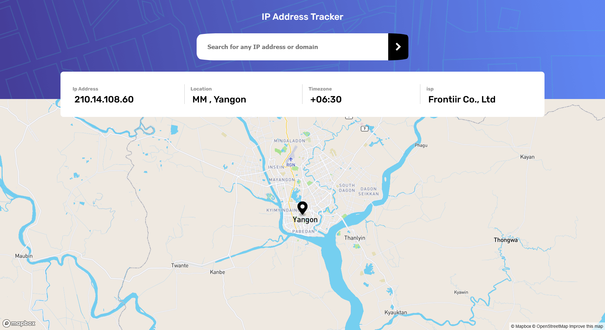
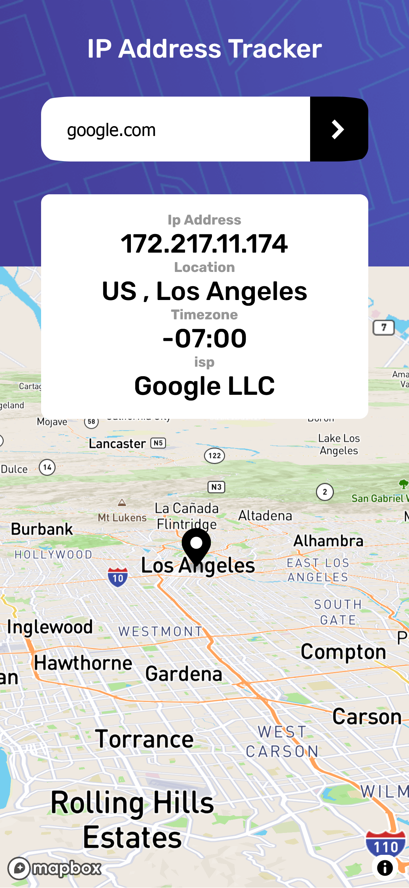

# Frontend Mentor - IP address tracker solution

This is a solution to the [IP address tracker challenge on Frontend Mentor](https://www.frontendmentor.io/challenges/ip-address-tracker-I8-0yYAH0). Frontend Mentor challenges help you improve your coding skills by building realistic projects. 

## Table of contents

- [Frontend Mentor - IP address tracker solution](#frontend-mentor---ip-address-tracker-solution)
	- [Table of contents](#table-of-contents)
	- [Overview](#overview)
		- [The challenge](#the-challenge)
		- [Screenshot](#screenshot)
		- [Links](#links)
	- [My process](#my-process)
		- [Built with](#built-with)
		- [What I learned](#what-i-learned)
## Overview
- track Ip Address and Domain
- show Location of Ip Address and Domain 

### The challenge

Users should be able to:

- View the optimal layout for each page depending on their device's screen size
- See hover states for all interactive elements on the page
- See their own IP address on the map on the initial page load
- Search for any IP addresses or domains and see the key information and location

### Screenshot

- Desktop

- Mobile

### Links

- Solution URL: [Add solution URL here](https://github.com/mgkyawmyotun/frontend_mentor_challenges/tree/master/ip-address-tracker-master)
- Live Site URL: [Add live site URL here](domaintracker.netlify.app)

## My process
- built site and upload to netlify

### Built with

- Semantic HTML5 markup
- SASS
- Flexbox
- CSS Grid
- Mobile-first workflow
- [React](https://reactjs.org/) - JS library
- TypeScript
- mapbox-gl
- snowpack
- netlify
### What I learned
I learned sass and others more about making responsive 
